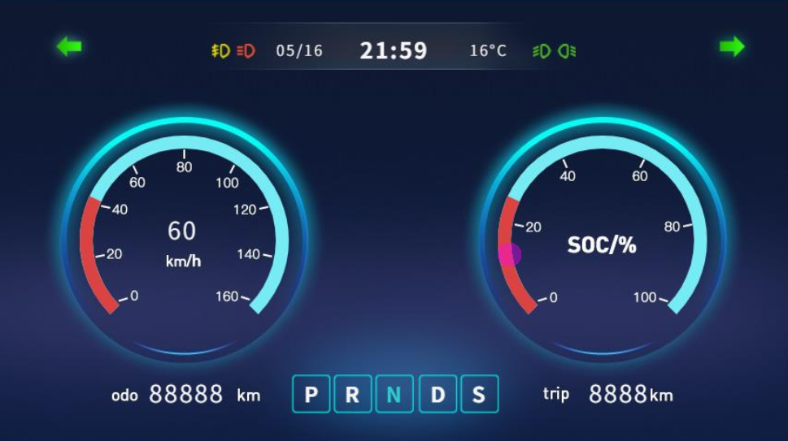

# QuecPython Electric Bicycle Instrumentation Solution

[中文](README_ZH.md) | English


## Table of Contents

- [Introduction](#introduction)
- [Features](#features)
- [Getting Started](#getting-started)
  - [Prerequisites](#prerequisites)
  - [Installation](#installation)
  - [Running the Application](#running-the-application)
- [Directory Structure](#directory-structure)
- [Contributing](#contributing)
- [License](#license)
- [Support](#support)

## Introduction

The two-wheel large-screen instrument solution launched by QuecPython is mainly aimed at the two-wheel motorcycle industry. Different from the traditional electric two-wheel vehicle instrument panel, it basically adopts the design of monochrome screen, and uses a larger LCD color instrument panel design, including Bluetooth music/phone, GNSS point/speed measurement, audio, vehicle-machine communication, cloud communication and other multiple functions. Users can carry out secondary development based on this scheme.



The Electric Bicycle Instrumentation solution uses [LVGL](https://lvgl.io/) to draw graphical interfaces. LVGL is a lightweight, open-source embedded graphics library. QuecPython has integrated LVGL and uses NXP's [GUI Guider](https://www.nxp.com/design/software/development-software/gui-guider:GUI-GUIDER) as a graphical interface design tool to automatically generate QuecPython code, greatly improving the efficiency of embedded platform graphical interface design.

Page UI includes startup LOGO display, real-time navigation information display, Bluetooth status display, vehicle status display (speed, mileage, endurance, light, driving, parking, locking), fault status display, etc., and has multiple sets of GUI options

## Features

- Startup LOGO: Supports startup LOGO customization
- GNSS location: GPS/ base station /WIFI location is optional
- Bluetooth phone/audio: Supports Bluetooth audio/call and Bluetooth navigation synchronization
- Vehicle communication: vehicle status display
- Cloud communication: remote control and status reporting

## Getting Started

### Prerequisites

Before you begin, ensure you have the following prerequisites:

- **Hardware**:
  - A QuecPython [QuecPython U235 EVB](https://python.quectel.com/doc/Getting_started/en/evb/ec600u-235.html)
  - USB Data Cable (USB-A to USB-C)
  - PC (Windows 7, Windows 10, or Windows 11)

- **Software**:
  - USB driver for the QuecPython module
  - QPYcom debugging tool
  - QuecPython firmware and related software resources
  - Python text editor (e.g., [VSCode](https://code.visualstudio.com/), [Pycharm](https://www.jetbrains.com/pycharm/download/))


### Installation

1. **Clone the Repository**：

   ```
   git clone https://github.com/QuecPython/solution-electric-bicycle-instrumentation.git
   cd solution-electric-bicycle-instrumentation
   ```

2. **Flash the Firmware**： Follow the [instructions](https://python.quectel.com/doc/Application_guide/en/dev-tools/QPYcom/qpycom-dw.html#Download-Firmware)将固件烧录到开发板上。**Note When downloading the firmware, you need to select the EXTFS8M model **

### Running the Application

1. **Connect the Hardware**:
   - Insert the SIM card into the SIM card slot.
   - Connect the antenna.
   - Use a USB data cable to connect the development board to the computer's USB port.

2. **Download Code to the Device**:
   - Launch the QPYcom debugging tool.
   - Connect the data cable to the computer.
   - Press the **PWRKEY** button on the development board to start the device.
   - Follow the [instructions](https://python.quectel.com/doc/Application_guide/en/dev-tools/QPYcom/qpycom-dw.html#Download-Script) to import all files within the `code` folder into the module's file system, preserving the directory structure.

3. **Run the Application**:

	1. Boot and wait for main.py to run automatically
	2. Run it manually and change the 'main.py' file name to 'main_t.py' before downloading the code to the device

	- Select the 'File' TAB.
	- Select the 'main_t.py' script.
	- Right-click and select 'Run' or use the 'Run' shortcut button to execute the script.
	- If you only want to debug the UI part, delete the main.py script and select ui2.py to run

## Directory Structure

```plaintext
solution-electric-bicycle-instrumentation/
├── code/
│   ├── drivers/            # Driver dependent code
│   ├── images2/            # UI image related resources
│   ├── utils.py            # Common tools and base classes
│   ├── bms.py              # Battery management related code
│   ├── classsicbt.py       # Bluetooth related code
│   ├── const.py            # Code run related configuration parameters
│   ├── controller.py       # Vehicle-machine communication controller code
│   ├── gps.py           	# GPS navigation code
│   ├── main.py            	# Application entry script
│   ├── mcudata.py          # Sensor data acquisition code
│   ├── network.py          # Network related code
│   ├── serial.py           # Serial port communication code
│   ├── setting.py          # The configuration file reads and saves the relevant code
│   ├── ui2.py            	# ui related code
│   ├── uidemo.py           # ui demo related code (only run the ui part for effect presentation)
```


## Contributing

We welcome contributions to improve this project! Please follow these steps to contribute:

1. Fork the repository.
2. Create a new branch (`git checkout -b feature/your-feature`).
3. Commit your changes (`git commit -m 'Add your feature'`).
4. Push to the branch (`git push origin feature/your-feature`).
5. Open a Pull Request.

## License

This project is licensed under the Apache License. See the [LICENSE](LICENSE) file for details.

## Support

If you have any questions or need support, please refer to the [QuecPython documentation](https://python.quectel.com/doc/en) or open an issue in this repository.