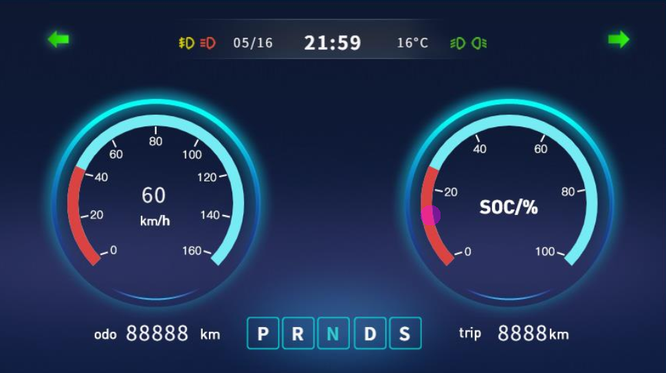

# QuecPython两轮车大屏仪表解决方案
中文 | [English](README.MD)

## 目录

- [介绍](#介绍)
- [功能](#功能)
- [快速开始](#快速开始)
  - [先决条件](#先决条件)
  - [安装](#安装)
  - [运行应用程序](#运行应用程序)
- [目录结构](#目录结构)
- [贡献](#贡献)
- [许可证](#许可证)
- [支持](#支持)

## 介绍

QuecPython推出的两轮车大屏仪表解决方案主要针对两轮电单车行业，区别于传统的电动两轮车仪表盘基本采用单色屏的设计，使用了更大的LCD彩色仪表盘设计，包含了蓝牙音乐/电话、GNSS点位/测速、音频、车机通信、云端通信等多重功能，用户可基于此方案进行二次开发.



仪表方案使用 [LVGL](https://lvgl.io/) 绘制图形化界面，它是一个轻量级的、开源的嵌入式图形库。QuecPython 集成了 LVGL，并且使用 NXP 公司的 [GUI Guider](https://www.nxp.com/design/software/development-software/gui-guider:GUI-GUIDER) 作为图形化界面设计工具，能自动生成 QuecPython 代码，极大提高了嵌入式平台图形化界面设计的效率。

页面UI包含开机LOGO显示、实时导航信息显示、蓝牙状态显示、车辆状态显示（速度、里程、续航、灯光、行驶\驻车\锁车）、故障状态显示等，并且拥有多套GUI可选

## 功能

- 开机LOGO：支持开机LOGO定制
- GNSS定位：GPS/基站/WIFI定位可选
- 蓝牙电话/音频：支持蓝牙音频/通话已经蓝牙导航同步
- 车机通信：车辆状态显示
- 云端通信：远程控制与状态上报

## 快速开始

### 软硬件准备

在开始之前，请确保您具备以下先决条件

- 硬件
  - 一块[QuecPython U-235开发板](https://python.quectel.com/doc/Getting_started/zh/evb/ec600u-235.html)
  - USB 数据线（USB-A 转 USB-C）
  - 电脑（Windows 7、Windows 10 或 Windows 11）
- 软件
  - QuecPython 模块的 USB 驱动
  - QPYcom 调试工具
  - QuecPython 固件及相关软件资源
  - Python 文本编辑器（例如，[VSCode](https://code.visualstudio.com/)、[Pycharm](https://www.jetbrains.com/pycharm/download/)）

### 安装

1. **克隆仓库**：

   ```
   git clone https://github.com/QuecPython/solution-electric-bicycle-instrumentation.git
   cd solution-electric-bicycle-instrumentation
   ```

2. **烧录固件**： 按照[说明](https://python.quectel.com/doc/Application_guide/zh/dev-tools/QPYcom/qpycom-dw.html#Download-Firmware)将固件烧录到开发板上。**注意在下载固件的时候需要选择EXTFS8M型号**

### 运行应用程序

1. **连接硬件**：

   - 使用 USB 数据线将开发板连接到计算机的 USB 端口。

2. **将代码下载到设备**：

   - 启动 QPYcom 调试工具。
   - 将数据线连接到计算机。
   - 按下开发板上的 **PWRKEY** 按钮启动设备。
   - 按照[说明](https://python.quectel.com/doc/Application_guide/zh/dev-tools/QPYcom/qpycom-dw.html#Download-Script)将 `code` 文件夹中的所有文件导入到模块的文件系统中，保留目录结构。

3. **运行应用程序**：

   1. 开机等待`main.py`自动运行
   2. 手动运行，下载代码到设备前先修改`main.py`文件名称为`main_t.py`

   - 选择 `File` 选项卡。
   - 选择 `main_t.py` 脚本。
   - 右键单击并选择 `Run` 或使用`运行`快捷按钮执行脚本。
   - 如果只想调试UI部分，请删除`main.py`脚本，选择`ui2.py`运行

## 代码目录结构

```
solution-electric-bicycle-instrumentation/
├── code/
│   ├── drivers/            # 驱动相关代码
│   ├── images2/            # UI图片相关资源
│   ├── utils.py            # 公共工具和基类
│   ├── bms.py              # 电池管理相关代码
│   ├── classsicbt.py       # 蓝牙相关代码
│   ├── const.py            # 代码运行相关配置参数
│   ├── controller.py       # 车机通信相关控制器代码
│   ├── gps.py           	 # GPS导航相关代码
│   ├── main.py             # 程序入口文件
│   ├── mcudata.py          # 传感器数据采集相关代码
│   ├── network.py          # 网络相关代码
│   ├── serial.py           # 串口通信相关代码
│   ├── setting.py          # 配置文件读取保存相关代码
│   ├── ui2.py            	 # ui相关代码
│   ├── uidemo.py           # ui演示相关代码(只运行ui部分，用于效果展示)
```

## 贡献

我们欢迎对本项目的改进做出贡献！请按照以下步骤进行贡献：

1. Fork 此仓库。
2. 创建一个新分支（`git checkout -b feature/your-feature`）。
3. 提交您的更改（`git commit -m 'Add your feature'`）。
4. 推送到分支（`git push origin feature/your-feature`）。
5. 打开一个 Pull Request。

## 许可证

本项目使用 Apache 许可证。详细信息请参阅 [LICENSE](https://github.com/QuecPython/solution-wearable/blob/master/LICENSE) 文件。

## 支持

如果您有任何问题或需要支持，请参阅 [QuecPython 文档](https://python.quectel.com/doc) 或在本仓库中打开一个 issue。